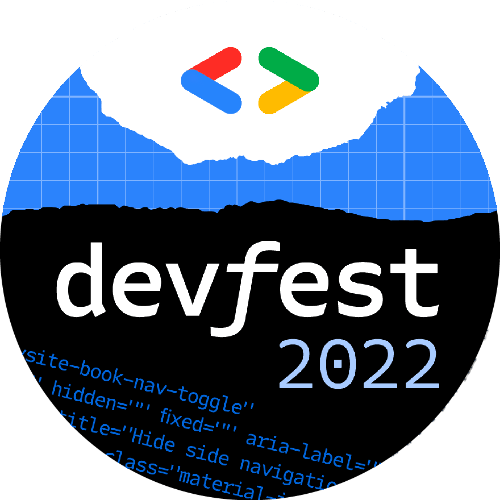

# DevFest Dakar Demo Code

  

For better organisation and best practices purposes, i separate the `GitOps` repository from the `Application code` repository.  

There respective location are :

- GitOps ==> <https://github.com/PapiHack/devfest-dakar-2022-demo-gitops>.

- App Code ==> <https://github.com/PapiHack/devfest-dakar-2022-demo-app>.

The slides are also available at <https://meissa-devfest-dakar-2022-prez.netlify.app>.

## Author

- [M.B.C.M](https://itdev.sn)

